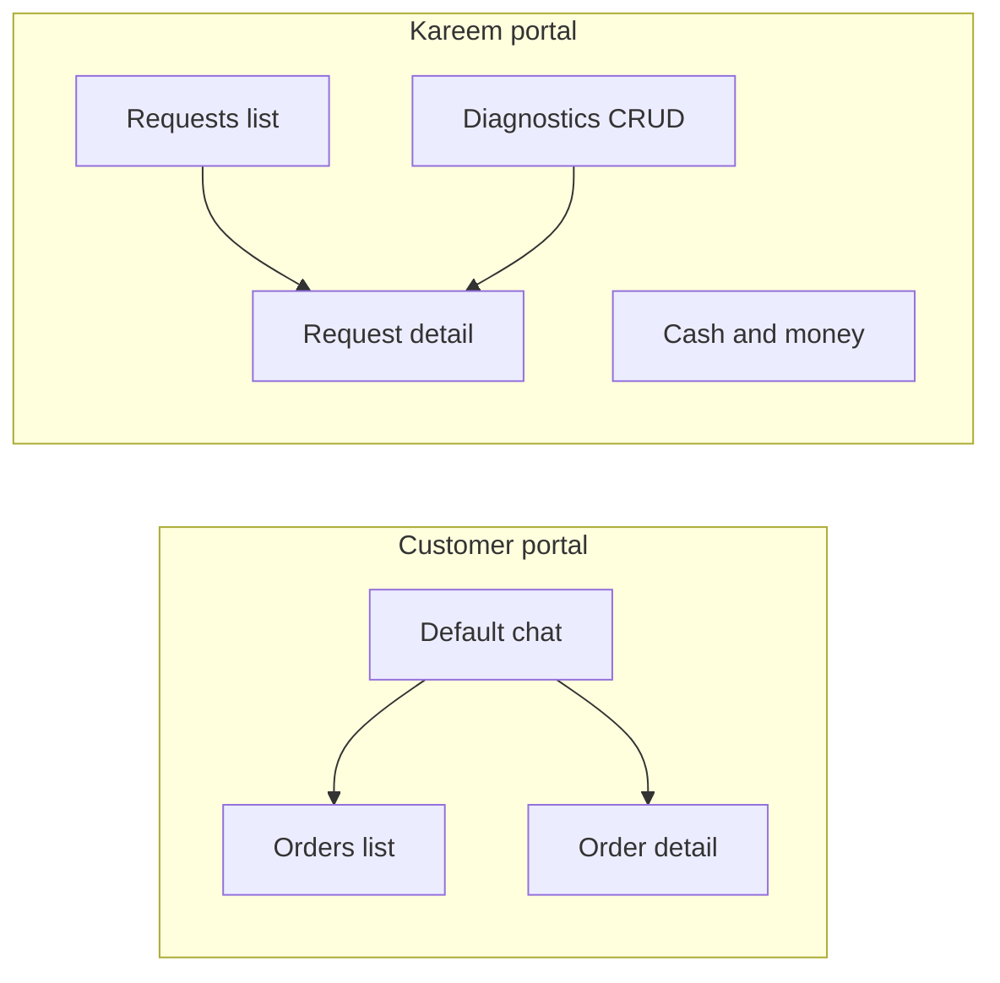
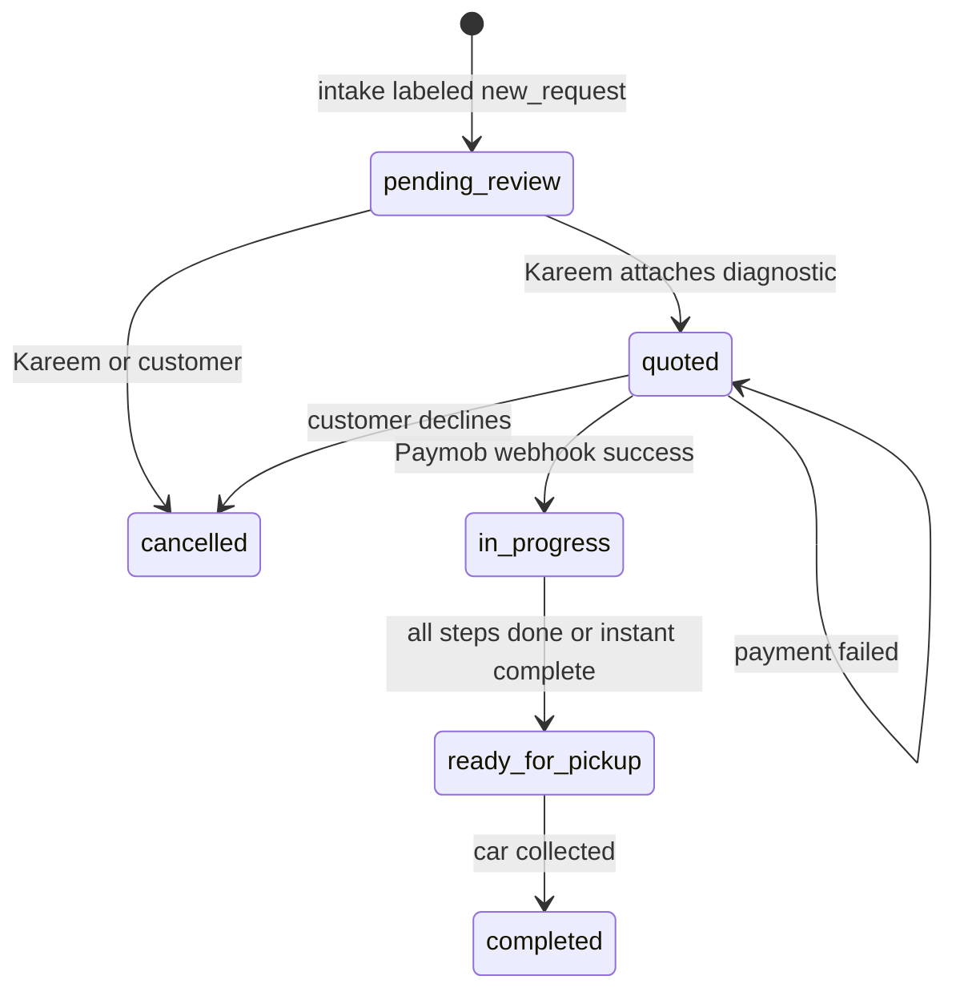
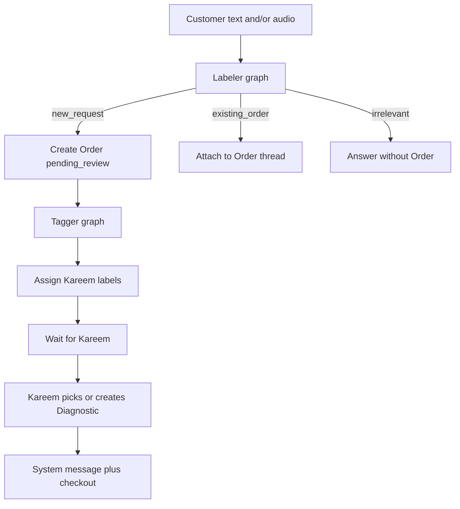

# Warsha (ورشة) — Agent & Team Contract

**Read this before writing models, routes, or UI.** If code and this file disagree, fix the code or update this file in the same change.

| Locked decision | Value |
|-----------------|-------|
| Product name | **Warsha** / **ورشة** |
| Scope | One garage, one mechanic admin (Kareem), many customers — **not** a marketplace |
| Customer identity (v1) | Phone number, **no OTP** — trust the number |
| Phone format | E.164 (`+20…`) — same field maps to WhatsApp later |
| Kareem auth | Django staff user (password), not phone login |
| Currency | EGP |
| Timezone | `Africa/Cairo` |
| Default language | Arabic (`ar`), English (`en`) supported |

---

## 1. Persona & jobs-to-be-done

**Karim** is 29, runs a garage in Shubra. Trusted in his neighbourhood, invisible outside it. Diagnoses cars over the phone, then spends a lot of time following up with customers.

| Pain | Product job |
|------|-------------|
| Twenty minutes on strangers who never come in | Intake **chat** that becomes a real **Order** only when the message is a repair request |
| Can name the fault from engine audio but customers don't understand time/cost | Canned **Diagnostics** with priced **Steps**, quoted as a clear **Agreement** |
| Verbal quotes → haggle, delay, vanish | **Paymob checkout** before work starts |
| Customers ring all day asking "is it ready?" | Live **step progress** + **ready for pickup** notification |

---

## 2. Two portals, one domain



### Customer portal

| Screen | Purpose |
|--------|---------|
| **Chat** (default) | Send text and/or audio; AI routes to new order, existing order, or irrelevant reply |
| **Orders list** | All orders with status, progress, line actions |
| **Order detail** | Conversation, agreement (diagnostic + price + ETA), checkout or cancel, timeline |

### Kareem portal (`/k/`, staff-only)

| Screen | Purpose |
|--------|---------|
| **Requests list** (default) | Same `Order` rows — Kareem calls them "requests" |
| **Request detail** | View intake, pick/create diagnostic, message customer, update steps/status, instant complete |
| **Diagnostics** | CRUD for quote templates (name, price, steps) |
| **Cash and money** | Payment ledger, daily totals, Paymob status links |

### URL namespaces (locked)

| Path | Audience |
|------|----------|
| `/` | Customer chat |
| `/orders/` | Customer orders list |
| `/orders/<id>/` | Customer order detail |
| `/k/` | Kareem portal root |
| `/api/` | REST (Paymob checkout, future WhatsApp) |
| `/webhooks/paymob/` | Paymob callback (CSRF-exempt, HMAC-verified) |

---

## 3. Canonical vocabulary

**Do not invent synonyms.** One model, one name in code.

| Term | Definition |
|------|------------|
| **Customer** | Phone-identified user (`Customer` model) |
| **Kareem / Mechanic** | The single staff admin |
| **Label** | Kareem-defined tag for filtering/classifying orders |
| **Diagnostic** | Reusable quote template: name, price (EGP), ordered **Steps** |
| **Step** | One repair phase: title, description, expected duration (minutes) |
| **Order** | The single work entity. Customer UI: "orders". Kareem UI: "requests". **Same model.** |
| **Conversation** | Message thread. Intake inbox (`order=null`) or per-order thread |
| **Message** | Text and/or audio. Channel: `web` now, `whatsapp` later |
| **Agreement** | Snapshot of diagnostic + price + steps on the Order at quote time |
| **Payment** | Paymob intention/transaction tied to one Order |

**Never create a separate `Request` model.** Kareem's "request" = `Order`.

---

## 4. Domain model

### Apps (do not dump models into `buildathon2/`)

| App | Models |
|-----|--------|
| `accounts` | `Customer`, mechanic staff (Django `User` + staff flag) |
| `catalog` | `Label`, `Diagnostic`, `DiagnosticStep` |
| `jobs` | `Order`, `OrderStep`, `Conversation`, `Message` |
| `payments` | `Payment` |
| `ai` | Cursor LLM adapter, LangGraph labeler/tagger |

### Core relations

```
Customer (phone unique, E.164)
Label ──M2M── Order
Diagnostic ──1:N── DiagnosticStep (template)
Order ──FK── Customer
Order ──M2M── Label
Order ──FK── Diagnostic (optional, source template)
Order ──1:N── OrderStep (snapshot at quote time)
Conversation ──FK── Order (nullable; null = intake inbox)
Conversation ──1:N── Message
Payment ──FK── Order
```

### `Order` fields (minimum)

- `status` — see state machine below
- `customer` FK
- `labels` M2M
- `diagnostic` FK (nullable — which template was used)
- `quoted_price` — snapshotted EGP amount at quote time
- `kareem_note` — message sent with the quote
- `created_at`, `updated_at`

### `OrderStep` (snapshot — do not read live `DiagnosticStep` after quote)

- `order` FK
- `title`, `description`, `expected_minutes`
- `sort_order`
- `completed_at` (null = incomplete)

### `Message`

- `conversation` FK
- `author_type`: `customer` | `mechanic` | `system`
- `body` (text, nullable)
- `audio` (file, nullable)
- `channel`: `web` | `whatsapp`
- `created_at`

### Progress & ETA

- **Remaining ETA** = sum of `expected_minutes` on `OrderStep` where `completed_at` is null
- Completing a step notifies the customer
- **Instant complete** (Kareem only): mark every remaining step done → `ready_for_pickup`

### Agreement snapshot rule

When Kareem quotes, copy diagnostic name, price, and all steps onto the Order. Later edits to `Diagnostic` / `DiagnosticStep` must **not** mutate quoted or paid orders.

---

## 5. Order state machine



### Status enum (code — snake_case, never translated)

| Status | Meaning |
|--------|---------|
| `pending_review` | Customer submitted; Kareem has not quoted |
| `quoted` | Diagnostic attached; awaiting payment or cancel |
| `in_progress` | Payment verified; work underway |
| `ready_for_pickup` | All steps done; customer should come |
| `completed` | Car collected (optional terminal state) |
| `cancelled` | Closed without completion |

### Transition rules

1. **No work before payment.** Kareem cannot complete steps until `in_progress`. Only HMAC-verified webhook moves `quoted` → `in_progress`.
2. **Redirect is not truth.** Paymob return URL updates UI only. Never mark paid from query params.
3. **Quoted state** exposes checkout link + cancel to customer. System message includes diagnostic summary, Kareem's note, pay or cancel actions.
4. **Status copy** is bilingual in UI. Enum values stay English snake_case in code and DB.

---

## 6. Chat & AI flow



### Labeler (LangGraph)

Input: customer message (+ optional audio transcript).
Output: one of:

- `new_request` → create `Order` (`pending_review`), run Tagger
- `existing_order` → attach message to matching open order for this customer
- `irrelevant` → reply in chat, no Order created

"Existing" = this customer's orders in `pending_review`, `quoted`, `in_progress`, or `ready_for_pickup`.

### Tagger (LangGraph)

Input: new order content + Kareem's current `Label` set.
Output: list of label IDs to assign (multi-label). Kareem can override in UI.

### Audio handling

- Store audio file on `Message`. Kareem listens in portal.
- Optional STT → transcript fed to Tagger. **Do not block intake on STT failure.**
- STT is not an LLM call. If added, use a dedicated STT service; classification still goes through Cursor.

### LLM constraint (hackathon)

**Every in-product LLM call goes through one Cursor LLM adapter** (`ai.llm` or equivalent).

- LangChain / LangGraph allowed **only** with that adapter as the model
- **No** direct OpenAI, Anthropic, or Google LLM clients
- Cursor SDK (`cursor-sdk`) is the integration path for runtime LLM calls

---

## 7. Payments (Paymob)

Full integration spec: [`.cursor/skills/paymob/SKILL.md`](.cursor/skills/paymob/SKILL.md)

### Checkout flow

1. Backend creates Payment Intention (`POST` with Secret Key)
2. `special_reference` = Order id (correlation)
3. Amount in **piasters** (10000 = 100.00 EGP)
4. Customer redirected to Unified Checkout (`publicKey` + `client_secret`)
5. Paymob POSTs to `notification_url` → **source of truth**

### Webhook (non-negotiable)

- HMAC-SHA-512, field order from skill's `hmac-verification.md`
- **Fail closed** — reject before any DB write if HMAC mismatches
- **Idempotent** — unique constraint on Paymob `obj.id`
- On success: `quoted` → `in_progress`, notify Kareem
- CSRF-exempt on webhook view only

### Dev setup

- Cloudflare tunnel exposes local `notification_url`
- Another teammate owns production deployment (Elastic Beanstalk via GitHub Actions)

### Cash and money screen

- Local ledger: paid / pending / failed per Order
- Daily totals
- Link to Paymob transaction status
- App code does **not** call Paymob MCP for writes. Agents using MCP need explicit user confirmation per skill rules.

### Env vars (never commit)

```
PAYMOB_SECRET_KEY=
PAYMOB_PUBLIC_KEY=
PAYMOB_API_KEY=
PAYMOB_HMAC_SECRET=
PAYMOB_INTEGRATION_ID_CARD=
CURSOR_API_KEY=
```

When auditing webhook code, use Cursor command `/paymob-check-hmac`.

---

## 8. Notifications

### v1 (in-app)

- Django messages framework + HTMX poll or SSE on chat/order pages
- No Django Channels unless already justified elsewhere
- System events that trigger customer notification:
  - Quoted (diagnostic + checkout link)
  - Payment succeeded
  - Step completed
  - Ready for pickup

### Later (WhatsApp)

- `Message.channel` field already supports `whatsapp`
- Notify interface: implement `web` now, stub `whatsapp`
- **Do not build WhatsApp integration in v1**

---

## 9. i18n & design

### Languages

- `ar` (default), `en`
- RTL layout when `ar`
- Django: `LocaleMiddleware`, ``, `makemessages` / `compilemessages`
- **No hardcoded user-facing strings in views** — all through translation system

### Design direction

Premium neighbourhood workshop — **not** generic SaaS.

| Aspect | Direction |
|--------|-----------|
| Palette | Warm metal, oil, paper tones |
| Typography | Strong Arabic type; readable at arm's length |
| Customer chat | WhatsApp-class messaging feel, not a ticket form |
| Kareem screens | Dense, operational — filters by label/status, glanceable status |
| Tap targets | Large (mechanic hands, greasy screens) |
| Instant complete | Always visible on in-progress jobs |

### Templates & static

```
templates/
  customer/     # chat, orders
  mechanic/     # requests, diagnostics, money
  shared/       # base layout, components
static/
  css/          # one design system — no per-app CSS islands
```

---

## 10. Engineering rules

### Do

- Snapshot diagnostics onto orders at quote time
- Idempotent Paymob webhooks with DB unique constraint
- CSRF-exempt webhook view only (not the whole app)
- Media uploads for audio via Django `FileField` / storage
- Store phones as E.164
- Use `Africa/Cairo` timezone
- Price in EGP; Paymob amounts in piasters

### Don't

- Mark paid from Paymob redirect URL
- Let Kareem complete steps before `in_progress`
- Call any LLM except the Cursor adapter
- Create a parallel `Request` model
- Invent a second source of truth for step ETA
- Commit secrets or read `.env` into chat
- Hardcode user-facing strings (use i18n)
- Build WhatsApp in v1

### Dependencies note

`requirements.txt` currently lists both `djangorestframework` and unrelated `django-rest-framework==0.1.0`. When touching deps, keep only `djangorestframework`.

---

## 11. Commands

```bash
# Setup
python3 -m venv .venv
source .venv/bin/activate
pip install -r requirements.txt
python manage.py migrate
python manage.py runserver

# i18n
python manage.py makemessages -l ar -l en
python manage.py compilemessages

# Health check
curl http://127.0.0.1:8000/   # {"status":"ok"}
```

---

## 12. End-to-end happy path (reference)

1. Customer opens chat, enters phone (no OTP), sends text + engine audio
2. Labeler → `new_request`; Tagger assigns labels (e.g. "engine noise", "Shubra")
3. Order created: `pending_review`. Kareem sees it in requests list
4. Kareem listens to audio, picks existing Diagnostic (or creates one on the fly)
5. System snapshots diagnostic → OrderSteps; status → `quoted`
6. Customer gets system message: diagnostic summary, Kareem's note, checkout link, cancel
7. Customer pays via Paymob Unified Checkout
8. Webhook HMAC verified → `in_progress`; Kareem notified
9. Kareem completes steps one by one (or instant complete); customer notified each time
10. All steps done → `ready_for_pickup`; customer notified to collect car
11. Kareem marks `completed` when car is collected

---

## 13. What is out of scope for v1

- WhatsApp send/receive
- OTP / phone verification
- Multi-garage / marketplace
- Customer accounts with email/password
- Django Channels / WebSockets (unless team adds later)
- Direct OpenAI/Anthropic/Google LLM calls
